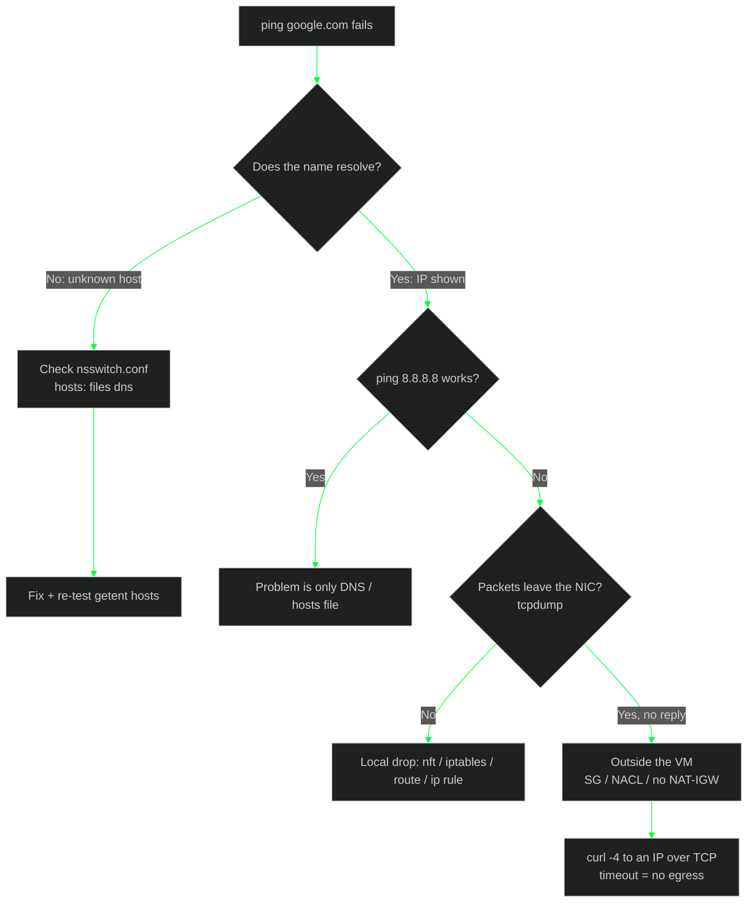

<div align="center">


<br/>


</div>

---

## `> cat ./scenario.txt`

```bash
krikox@matrix:~$ cat ./scenario.txt
```

> **Task:** `ping google.com` does not work on the server. Find out why and fix it.

The box is a Debian instance on AWS (`ens5`, VPC resolver at `10.1.0.2`). Two different problems are stacked on top of each other: a **name-resolution** misconfiguration (fixable) and a **network egress** limit (not fixable from inside the VM). The skill is telling them apart quickly.

---

## `> ./triage_flow.sh`



---

## `> ./runbook.sh`

Format per step: **command → symptom → fix**.

### `[01]` Reproduce and separate DNS from network

```bash
krikox@matrix:~$ ping google.com
krikox@matrix:~$ getent hosts google.com
krikox@matrix:~$ grep ^hosts /etc/nsswitch.conf
```

| Symptom | Meaning |
|---|---|
| `unknown host` / `Temporary failure in name resolution` | Resolution is broken (typical before the fix) |
| Name resolves to an IP but there are no replies | Resolution is fine, look at the network (go to step 04) |

`getent` goes through NSS exactly like `ping`, so it is the right way to test `nsswitch.conf`. `dig`/`nslookup` bypass NSS and can hide the bug.

---

### `[02]` Fix the NSS `hosts` line

```bash
krikox@matrix:~$ sudo sed -i 's/^hosts:.*/hosts:          files dns/' /etc/nsswitch.conf
krikox@matrix:~$ grep ^hosts /etc/nsswitch.conf
hosts:          files dns
```

- `files` = `/etc/hosts`, `dns` = the resolver in `/etc/resolv.conf`.
- Without `dns` in that line, the libc resolver never queries a DNS server, no matter how healthy the resolver is.
- Also check `/etc/hosts` for a fake `google.com` entry: with `files` first, it would win over DNS.

```bash
krikox@matrix:~$ grep -i google /etc/hosts
krikox@matrix:~$ getent hosts google.com
```

Result: the name now resolves. `ping` prints `PING google.com (142.250.x.x)`.

---

### `[03]` Confirm the resolver chain

```bash
krikox@matrix:~$ cat /etc/resolv.conf        # nameserver 127.0.0.53  (systemd-resolved stub)
krikox@matrix:~$ resolvectl status | head -20   # DNS Servers: 10.1.0.2 (AWS VPC resolver)
```

`127.0.0.53` is the normal `systemd-resolved` stub on Debian. Do not edit it. The real upstream is `10.1.0.2`, the VPC resolver, which answers locally and does not need internet access.

---

### `[04]` Ping still 100% loss: rule out local filtering

```bash
krikox@matrix:~$ sudo iptables -L
Chain INPUT (policy ACCEPT) ... Chain FORWARD (policy ACCEPT) ... Chain OUTPUT (policy ACCEPT)
```

> **Gotcha:** `iptables -L` only shows the `filter` table, and on modern Debian `iptables` is a wrapper over nftables. Check everything:

```bash
krikox@matrix:~$ sudo nft list ruleset          # empty = nothing loaded
krikox@matrix:~$ sudo iptables -S               # -S also shows policies
krikox@matrix:~$ sudo iptables -t nat -S
krikox@matrix:~$ sudo iptables -t mangle -S
krikox@matrix:~$ sudo iptables-legacy -S        # legacy backend has its own rules
krikox@matrix:~$ ip route
krikox@matrix:~$ ip rule
krikox@matrix:~$ ip -br addr
```

| Check | Observed | Verdict |
|---|---|---|
| `nft list ruleset` | empty | no local firewall |
| `ip route` | `default via 10.1.13.1 dev ens5` | route OK |
| `ip rule` | only `local`/`main`/`default` | no policy routing tricks |
| `ip -br addr` | `ens5 UP 10.1.13.51/24` | interface OK |

Everything local is clean.

---

### `[05]` Prove where the packet dies (tcpdump)

Run capture and ping **at the same time**. Running them one after the other captures nothing.

```bash
krikox@matrix:~$ sudo timeout 6 tcpdump -ni any icmp &
krikox@matrix:~$ sleep 1; ping -c3 8.8.8.8; wait
ens5  Out IP 10.1.13.51 > 8.8.8.8: ICMP echo request, id 5, seq 1
ens5  Out IP 10.1.13.51 > 8.8.8.8: ICMP echo request, id 5, seq 2
ens5  Out IP 10.1.13.51 > 8.8.8.8: ICMP echo request, id 5, seq 3
```

| Capture shows | Meaning |
|---|---|
| Requests out, **no replies** | Packet leaves the VM, something outside drops it |
| Nothing at all | Local drop (nft, route, `ip rule`) |

Here: requests go out, no replies. The block is outside the VM.

---

### `[06]` Confirm with TCP (not only ICMP)

```bash
krikox@matrix:~$ curl -4 -sI --max-time 5 https://google.com | head -1
krikox@matrix:~$ curl -4 -sv --max-time 5 https://8.8.8.8 2>&1 | tail -3
* Trying 8.8.8.8:443...
* Connection timed out after 5002 milliseconds
```

A TCP timeout to a **bare IP** (no DNS involved) means there is no internet egress at all from the VPC (no NAT/IGW route or a restrictive SG/NACL). That cannot be fixed from inside the VM.

---

## `> cat ./root_cause.txt`

| # | Layer | Finding | Fixable from the VM? |
|---|---|---|---|
| 1 | Name resolution | `hosts` line in `/etc/nsswitch.conf` was missing `dns` | Yes: `hosts: files dns` |
| 2 | Network egress | ICMP and TCP to the internet time out with a clean local config | No: VPC / security group level |

<!-- TODO: add the final verdict from "Check My Solution" (pass/fail) once confirmed in the SadServers UI -->

---

## `> ./playbook_cheatsheet.sh`

| Command | Symptom | Fix |
|---|---|---|
| `getent hosts <name>` | empty / `unknown host` | `hosts: files dns` in `/etc/nsswitch.conf` |
| `grep -i <name> /etc/hosts` | fake entry pointing to a dead IP | delete the line (`files` wins over `dns`) |
| `resolvectl status` | wrong or missing DNS server | fix the link's DNS, do not edit the stub `resolv.conf` |
| `sudo nft list ruleset` + `iptables -S` (+ `-t nat`/`mangle`, `iptables-legacy`) | `drop`/`reject` on output that `iptables -L` did not show | delete the rule or `nft flush ruleset` |
| `ip route` / `ip rule` | no `default via`, blackhole, empty custom table | `ip route add default via <gw> dev <if>` |
| `tcpdump -ni any icmp` (run **with** the ping) | requests out, no replies | block is external: SG/NACL/NAT |
| `curl -4 --max-time 5 https://<IP>` | timeout by IP | no egress, nothing to fix locally |

---

## `> ./lessons_learned.sh`

- **`iptables -L` is not the whole firewall.** Use `nft list ruleset`, `iptables -S`, the other tables and `iptables-legacy`.
- **Ping is a bad DNS test.** Use `getent hosts`: it follows `nsswitch.conf`, like real applications do.
- **Test by IP first** (`8.8.8.8`) to split DNS problems from network problems.
- **Capture and generate traffic simultaneously.** A `tcpdump` that ends before the ping starts proves nothing.
- **A clean local stack + timeouts = look outside the box.** Do not keep tuning the VM when the packets already leave the NIC.
- **Typos cost time:** `https//` (missing colon) makes `curl` fail silently with `-s`.

---

<div align="center">


</div>
